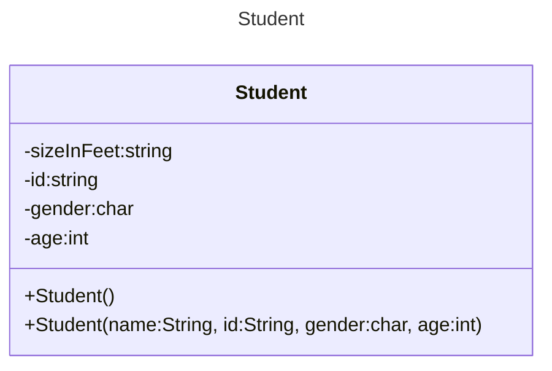
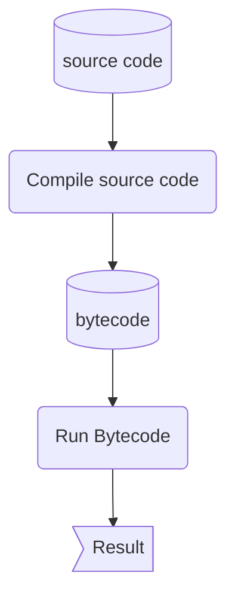

>[!WARNING] Knowledge
>This note assumes some familiarity with programming languages.

# What is Object-Oriented Programming?
>[!DEFINITION] OOP
>It is a Programming paradigm that represents concepts as objects with attributes (*datatypes*) and methods (*functions*)

An object oriented program can be seen as objects interacting with another object. The Java language is built based on OOP paradigm while its sibling, Haskell, is built around functional programming.  ^593cb2

>[!DEFINITION] Functional Programming
>It is also a programming paradigm that represents concepts, but it is purely in functions. Everything is done via recursion. It has a steeper learning curve despite its misleading name.

*How about procedural programming?*
Procedural programming is what most programmers do.

>[!DEFINITION] Procedural Programming
>A form of programming practice that focuses on creating "procedures" or functions that implement the program's logic. Data is passed to the function and the function performs operations on the data.

The problem with procedural programming is that the methods and variables are separated from the object. Take this for example,

*Snippet A: procedural programming*
```cpp
#include <iostream>
#include <string_view>

enum AnimalType
{
	cat,
	dog,
	chicken,
};

constexpr std::string_view animalName(AnimalType type){
	switch(type){
		case cat:
			return "cat";
		case dog:
			return "dog";
		case chicken:
			return "chicken";
		default:
			return "";
	}
}

constexpr int numLegs(AnimalType type){
	switch(type){
		case cat:
			return 4;
		case dog:
			return 4;
		case chicken:
			return 2;
		default:
			return 0;
	}
}
int main(){
	constexpr  AnimalType animal{ cat };
	std::cout << "A " << animalName(animal) << " has " << numLegs(animal) << " legs\n";
	
	return 0;
}
```
Say it's still **ooga booga** age, but programming somehow exists, and you discovered a new animal! *Yay!*. But since the code is done in procedural programming, you would have to update the `enum`, `animalName`, and `numLegs`. If it is a large codebase, imagine the amount of changes that have to be done. 

<mark style="background: #FFF3A3A6;"><em>The first benefit:  the increase in reusability</em></mark>
<mark style="background: #FFF3A3A6;"><em>The second benefit: easier to modify and maintain</em></mark>

Since each object is *very, closely, very-very related* to its characteristics and methods, programmers have to properly plan and design each object before implementing them. They're *coerced* into designing and implementing **good code**

*<mark style="background: #FFF3A3A6;"><em>The third benefit: Less flaws as programmers are required to plan properly before implementation</em></mark>

*You hired another cavemen to help you but he's completely new to coding. You start to worry about all the bugs and maintenances you have to do; but, should you?*

<mark style="background: #FFF3A3A6;">You shouldn't. Well, if you do it right. OOP introduces a concept called <strong>encapsulation</strong></mark>

>[!DEFINITION] Encapsulation
>The act of hiding certain methods or variables so that only certain classes can access them. 

**But, is OOP really that great?**
No. OOP has a low skill floor but high master ceiling (*easy to pick up but hard to master*). 

When the project scales large, the program can be slower. Think about it, in Java, every time you want to created a function, you have to create a whole new class.
# Classes and Objects
## What are objects?
Objects are made up of *attributes* and *methods*. For example, a student.
```java
public class Student{
	public Student(){};
	public Student(String name, String id, char gender, int age){
		this.name = name;
		this.id = id;
		this.gender = gender;
		this.age = age;
	}
	private String name;
	private String id;
	private char gender;
	private int age;
}
```


>[!NOTE]- Signs
>*-* means private
>*+* means public
>Methods that do not have return type are `constructors`

>[!DEFINITION] Classes
>Classes are basically blueprints that is used to create objects. 

Every person is a human, but every human is also very different; each of us have similar features, have the same basic life processes, but we also do, feel, and think in vastly different manners from each other. What I'm trying to say is that we are made from the same blueprint but each of us also has our defining characteristics and personalities. 

>[!DEFINITION] Objects
>Objects are instances of classes. 
>>[!EXAMPLE]
>>Human is a blueprint while Levin is an object.

Classes by itself cannot achieve anything. It can only be used to create objects. 

>[!DEFINITION] Instantiation
>The act of creating an object from a class. 

# Java 
The design of java revolves around *write once, run anywhere*. This means that Java is platform independent. 


## Java Syntax
*Snippet A: Driver code*
```java
public class Main{
	public static void main(String args[]){
		Student levin = new Student();
		System.out.println(levin.isStudent());
	}
}
```
*Snippet B: Student code*
```java
public class Student{
	public Student(){};
	public Student(String name, String id, char gender, int age){
		this.name = name;
		this.id = id;
		this.gender = gender;
		this.age = age;
	}
	public boolean isSTudent(){
		return true;
	}
	private String name;
	private String id;
	private char gender;
	private int age;
}
```
*The syntax in Java is very similar to the syntax is C++, so the following highlights only noteworthy differences.*

To recap, [[Introduction to OOP#^593cb2|OOP paradigm in Java.]]
Every Java program must have **at least one class**.

*Snippet C: Main*
```java
public class Main{
	public static void main(String args[]){
		Student levin = new Student();
		System.out.println(levin.isStudent());
	}
}
```
The main function is the **at least one class**. Every class is declared with `public/private/protected class <name>` with the `<name>` as the name of the file.

*Can I make the `main` class or  the `main` function private?*
You can, but why?. 
The `main` function is public so that the OS or the runtime environment can access it to start the program. If these are made `private`, the program will not have a clear entry point, leading to runtime errors or the program simply not running at all.

*I still want to do procedural programming! How do I achieve that?*
You can *sort-of* achieve that with `static` keyword.
When you use `static` in Java, it can mean 3 things:
1. The variable belongs to the class instead of an object
	- A circle class with static variable `color` will have every object instantiated from it share the same colour.
1. The method can be called without instantiating an object. 
	- `<ClassName>.method()`
2. Static method can only access static variables and other `static` methods.
	- This is important to keep in mind

*Why does the `main` method require so many parameters?*
1. `public`
	- This is an access modifier. 
		- Public means anyone (`globally`) can access it
	- Making this public ensures that `JVM` can run the program.
3. static
	- This is so that `JVM` can access the `main` method without creating an object.
4. void
	- No value is returned from the `main` method. 
	- When the `main` function terminates, the programme terminates so, there's no point in returning anything.
6. main
	- It's a name that `JVM` looks for as the starting point of a programme.
7. String\\\[\] args
	- It is an array of type String named args (arguments).  

## Libraries
In C++, you import libraries like this
```c++
#include <iostream>
```
In Java,
```java
import java.<package>.<class>
```
*Is specifying the class necessary?*
No, you can import the whole package but will you actually use every class in the package? Chances are, 
you will be wasting space since you won't be using all of the classes.

```java
import java.package.*
```

# Variables
Unlike C++, Java is a safer language - there is no manual memory management involved. Instead, Java detects whether a variable is a primitive type or a reference type and handles the rest. 

*Snippet D: Types of datatype*
```java
int x = 5; // primitive
Student Levin; // Reference
```
>[!DEFINITION] Primitive type
>The variables store the actual values

>[!DEFINITION] Reference type
>The variables store the addresses of the `objects` or `arrays` they refer to.
>
>*Example*
>1. String
>2. Object
>3. Arrays

*Visualisation*
![[primitive-vs-reference.png]]

The list of primitive types can be found here:
[It's a long read]([Primitive Data Types (The Java™ Tutorials > Learning the Java Language > Language Basics) (oracle.com)](https://docs.oracle.com/javase%2Ftutorial%2F/java/nutsandbolts/datatypes.html))

#### Primitive types as Objects
Since some methods require the use of objects as arguments, Java offers - **Boolean**, **Character**, **Double**, **Float**, **Byte**, **Short**, **Integer**, **Long** wrapper classes in *java.lang* package

*Snippet D: Boxing and Unboxing*
```java
Integer intObj = 3;
int i = intObg;
```

## Casting
>[!DEFINITION] Widening
>Casting a variable of smaller type to a larger type
>```java
>double x;
>x = 5.5
>```
>Java does this automatically. 

>[!DEFINITION] Narrowing
>Casting a variable with a type with a larger range to a type with smaller range. 
>```java
>int x;
>x = (int) 5.5
>```
>This must be done manually. (*I'm assuming it's to avoid unnecessary loss of data*)

>[!INFO] Neighbours 
>Casting is done to the *nearest* type.


## Character and String
### Character
Similar to C++,  Java can accept both `char` and *ASCII* characters. 

*Snippet E: why would you do this*
```java
char letter = 'A';
char numChar = '4';
char letter = '\u0041';
char numChar = '\u0034';
```
However, Java characters use *Unicode* (It's a superset of ASCII) which takes two bytes, preceded by `\u`,expressed in four hexadecimal numbers - `\u0000` to `\FFFF`. 
>[!INFO] Number of characters
>*Unicode can represent 65535 characters.*


### String
Just like C++, `String` are objects/reference type. 

Java has built-in functions that help convert `string` to `int` or `double` types. 

```java
int i = Integer.parseInt("257");
double d = Double.parseDouble("23.57");
```
Conversely, you can also convert `int` type to `string` type.

```java
String s = Integer.toString(i);
String s2 = Double.toString(d);
```

## Constants
When it comes to constants, just the syntax is different from C++.
```c++
constexpr x = 5;
const x = 5
```
`constexpr` variables are initialised at compile time
```java
final y = 5;
const y = 5;
```
`const` variables are initialised at runtime.
