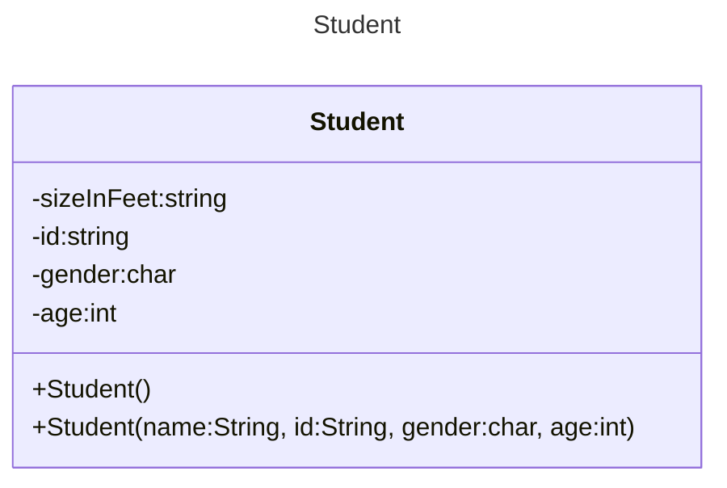

>[!WARNING] Knowledge
>This note assumes some familiarity with programming.
>Java language is used in the notes.

# What is Object-Oriented Programming?
>[!DEFINITION] OOP
>A programming paradigm that represents concepts as objects with attributes (*datatypes*) and methods (*functions*)

An object-oriented program can be seen as objects interacting with each other.

>[!INFO] Functional programming
>Haskell is built around functional programming.

>[!DEFINITION] Functional Programming
>A programming paradigm that represents concepts purely in functions.

>[!DEFINITION] Procedural Programming
>A programming paradigm that focuses on creating "procedures" or functions that implement the program's logic. Data is passed to the function and the function performs operations on the data.
## Benefits of Object-Oriented Programming
### Ease of Modification & Reusability
The problem with procedural programming is that the methods and variables are separated from the object. Take this for example,

*Snippet A: Procedural programming*
```cpp
#include <iostream>
#include <string_view>

enum AnimalType
{
	cat,
	dog,
	chicken,
};

constexpr std::string_view animalName(AnimalType type){
	switch(type){
		case cat:
			return "cat";
		case dog:
			return "dog";
		case chicken:
			return "chicken";
		default:
			return "";
	}
}

constexpr int numLegs(AnimalType type){
	switch(type){
		case cat:
			return 4;
		case dog:
			return 4;
		case chicken:
			return 2;
		default:
			return 0;
	}
}

int main(){
	constexpr  AnimalType animal{ cat };
	std::cout << "A " << animalName(animal) << " has " << numLegs(animal) << " legs\n";
	
	return 0;
}
```
Imagine you're in the Stone Age, but programming somehow exists. One day, you go hunting and you discovered a new animal! *Yay!*. 

However, since your existing database on animals is done with procedural programming, updating would be a bit of a hassle.

*Why?*<br>*Take the code above as an example*.<br>You would have to update the `enum`, `animalName`, and `numLegs`. If it is a large codebase, imagine the amount of changes that have to be done each time a new animal is discovered.

This highlights the two of the many benefits of OOP:
1. Greater reusability
2. Ease of modification

### Demands proper planning
*So, how do we modify the current database?*<br>Since each object is *closely related* to its attributes and methods, programmers have to properly plan and design each object before implementing them in the program.

The third benefit:
- **Possibly** lesser flaws as programmers are expected to perform meticulous planning and designing.

>[!TLDR]
>Programmers are *coerced* into designing and implementing **good code**
### Prevents Unintended Changes
*Say you hire another cavemen to help you, but he is new to OOP concept. You start to worry about all the bugs and maintenances you have to do; but, should you?*

You shouldn't. Well, if you do it right. OOP introduces a concept called <strong>encapsulation</strong>

>[!DEFINITION] Encapsulation
>The act of hiding certain methods or variables so that only certain classes can access them. 
## Drawbacks of Object-Oriented Programming
No. OOP has a low skill floor but high master ceiling.

*What do I mean by this?*<br>It is easy to pick up and learn the concepts of OOP even for beginners but, applying them properly is difficult, especially if future plans and developments have to be kept in mind. 

The program can also be slower when the project scales large.
# Classes and Objects
## What are objects?
Objects represent distinguishable entities that represent real-world entities or objects. Objects are made up of *attributes* and *methods*. For example, a `Student`.

*Snippet A: `Student` object*
```java
public class Student{
	public Student(){};
	public Student(String name, String id, char gender, int age){
		this.name = name;
		this.id = id;
		this.gender = gender;
		this.age = age;
	}
	private String name;
	private String id;
	private char gender;
	private int age;
}
```

>[!PRACTICE] Order
> [Order of Declaration](https://stackoverflow.com/questions/150479/order-of-items-in-classes-fields-properties-constructors-methods)



>[!DEFINITION] Classes
>Classes are basically *blueprints* that is used to create objects. 
^2bc1fc

Each of us have similar features; we possess the same basic life processes but, we also do, feel, and think in vastly different manners from one another.

This reflects the initial definition of a [[Introduction to OOP#^2bc1fc|class]], that is to say, that we are made from the same blueprint, but each of us also has our own defining characteristics and personalities.

>[!DEFINITION] Objects
>Objects are instances of classes. 
>>[!EXAMPLE]
>>Human is a `class`(blueprint) while Violet is an `object`.

>[!DEFINITION] Instantiation
>The act of creating an object from a class. 
## Java Syntax
*Snippet A: Java `main` function*
```java
public class Main{
	public static void main(String args[]){
		Student levin = new Student();
		System.out.println(levin.isStudent());
	}
}
```

*Snippet B: `Student` class*
```java
public class Student{
	public Student(){};
	public Student(String name, String id, char gender, int age){
		this.name = name;
		this.id = id;
		this.gender = gender;
		this.age = age;
	}
	public boolean isSTudent(){
		return true;
	}
	private String name;
	private String id;
	private char gender;
	private int age;
}
```

>[!TIP] Similarity
>The syntax in Java is very similar to the syntax in C++.

Every Java program must have **at least one class**.

*Snippet C: Java `main` function*
```java
public class Main{
	public static void main(String args[]){
		Student levin = new Student();
		System.out.println(levin.isStudent());
	}
}
```
The main function is the "at least one" class. Every class is declared with `public/private/protecte<access modifier> class <name>` with the `<name>` as the name of the file.

*Can I make the `main` class or  the `main` function private?*<br>You can, but why? The `main` function is `public` so that the OS or the runtime environment can access it to start the program. If these are made `private`, the program will not have a clear entry point, leading to runtime errors or the program not starting at all.

*Is it possible to still execute procedural programming in Java?*<br>You can *sort-of* achieve that with the `static` keyword.

When you use the `static` keyword in Java, it can mean 3 things:
1. The variable belongs to the class instead of an object
	- A `Circle` class with `static` variable `color` will have every object instantiated from that class share the same `colour`.
		- If the `color` in one object is changed, it changes for all objects, because they all refer to the same variable.
2. When the `static` keyword is applied on a method, the method can be called without instantiating an object. 
	- `<ClassName>.method()`
	1. Static method can only access `static` variables and other `static` methods.

*Why does the `main` method look the way it does?*
1. `public`
	- This is an access modifier. 
		- `public` means anyone (`globally`) can access it
	- Making this `public` ensures that `JVM` can run the program.
3. `static`
	- This is so that `JVM` can access the `main` method without creating an object.
4. `void`
	- No value is returned from the `main` method. 
	- When the `main` function terminates, the program terminates so, there's no point in returning anything.
6. `main`
	- It's a name that `JVM` looks for as the starting point of a program.
7. String\\\[\] args
	- It is an array of type String named args (arguments).  

## Libraries
In C++, you import libraries like this
```c++
#include <iostream>
```

In Java,
```java
import java.<package>.<class>
```

*Is specifying the class necessary?*
```java
import java.package.*
```
No, you can import the whole package but *will you actually use every class in the package?* It's likely that you won't use all of the classes.
# Variables
Unlike C++, Java is a safer language - there is no manual memory management involved. Instead, Java detects whether a variable is a primitive type or a reference type and handles the rest. 

*Snippet D: Types of datatype*
```java
int x = 5; // primitive
Student Levin; // Reference
```
>[!DEFINITION] Primitive type
>The variables store the actual values

>[!DEFINITION] Reference type
>The variables store the addresses of the `objects` or `arrays` they refer to.
>
>*Example*
>1. String
>2. Object
>3. Arrays

*Visualisation*
![[primitive-vs-reference.png]]

The list of primitive types can be found here:
[It's a long read]([Primitive Data Types (The Java™ Tutorials > Learning the Java Language > Language Basics) (oracle.com)](https://docs.oracle.com/javase%2Ftutorial%2F/java/nutsandbolts/datatypes.html))

#### Primitive types as Objects
Since some methods require the use of objects as arguments, Java offers - **Boolean**, **Character**, **Double**, **Float**, **Byte**, **Short**, **Integer**, **Long** wrapper classes in *java.lang* package

*Snippet D: Boxing and Unboxing*
```java
Integer intObj = 3;
int i = intObg;
```

## Casting
>[!DEFINITION] Widening
>Casting a variable of smaller type to a larger type
>```java
>double x;
>x = 5.5
>```
>Java does this automatically. 

>[!DEFINITION] Narrowing
>Casting a variable with a type with a larger range to a type with smaller range. 
>```java
>int x;
>x = (int) 5.5
>```
>This must be done manually. (*I'm assuming it's to avoid unnecessary loss of data*)

>[!INFO] Neighbours 
>Casting is done to the *nearest* type.


## Character and String
### Character
Similar to C++,  Java can accept both `char` and *ASCII* characters. 

*Snippet E: why would you do this*
```java
char letter = 'A';
char numChar = '4';
char letter = '\u0041';
char numChar = '\u0034';
```
However, Java characters use *Unicode* (It's a superset of ASCII) which takes two bytes, preceded by `\u`,expressed in four hexadecimal numbers - `\u0000` to `\FFFF`. 

>[!INFO] Number of characters
>*Unicode can represent 65535 characters.*
### String
Just like C++, `String` are objects/reference type. 

Java has built-in functions that help convert `string` to `int` or `double` types. 

```java
int i = Integer.parseInt("257");
double d = Double.parseDouble("23.57");
```
Conversely, you can also convert `int` type to `string` type.

```java
String s = Integer.toString(i);
String s2 = Double.toString(d);
```
## Constants
When it comes to constants, just the syntax is different from C++.
```c++
constexpr x = 5;
const x = 5
```
`constexpr` variables are initialised at compile time
```java
final y = 5;
const y = 5;
```
`const` variables are initialised at runtime.
# See Next
[[Methods in Java]]