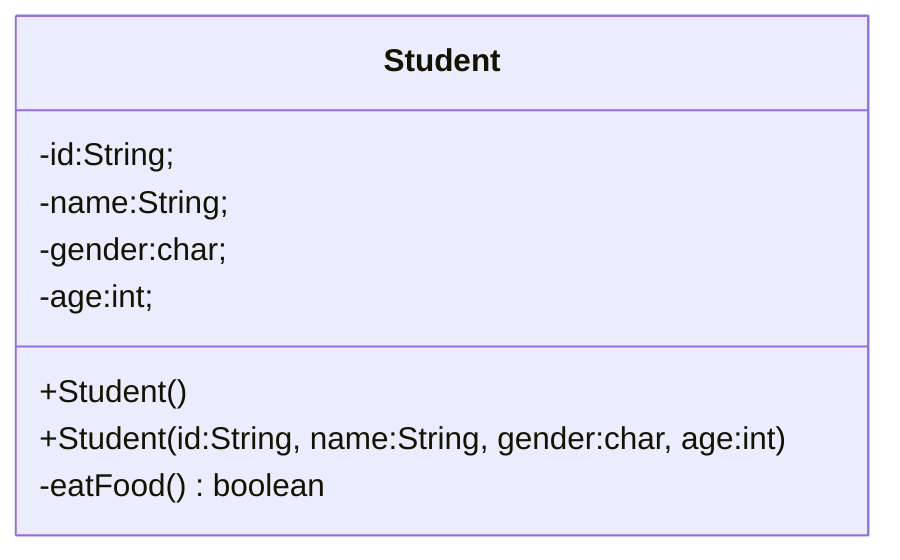
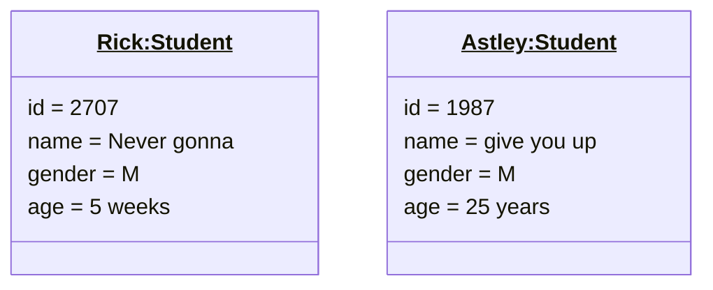
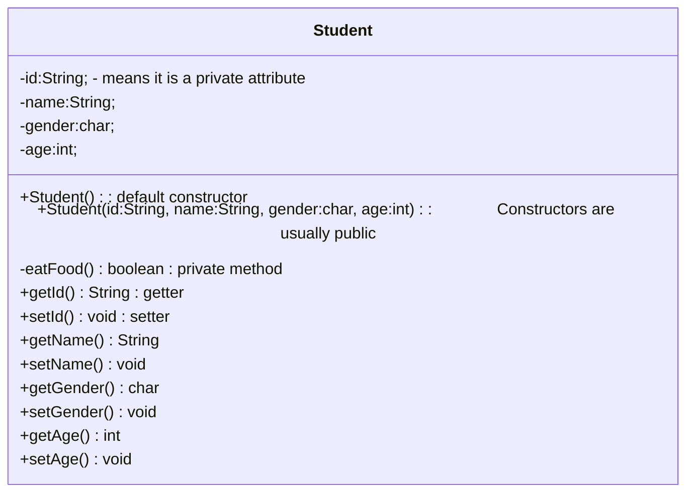

>[!Reminder] Programming Paradigm
>Java uses [[Introduction to OOP#What is Object-Oriented Programming?|OOP]]
# Java Classes
In languages that support OOP, classes usually looks like this 
```pseudocode
class CLASSNAME
	attributes
	constructor
	methods
```
In java specifically, it looks like this, 

*Snippet A: Student*
```java
public class Student{
	// Attributes
	private String id;
	private String name
	private char gender;
	private int age;
	private String course;
	
	// Constructors
	public Student(){}
	public Student(String id, String name, char gender, int age, String course){
		this.id = id;
		this.name = name;
		this.gender = gender;
		this.age = age;
		this.course = course;
	}
	
	// Methods
	public String getName(){ return name; }
}
```

^b9c2ac

Presenting our program in the form of code to outsiders can be inefficient and complicated. Keep in mind that [[Introduction to OOP#^981663|you have to plan]] before implementing any code. This begs for a method to visualise and show the flow and functions of the program in a non-esoteric manner. 

## UML Diagram
>[!DEFINITION] Unified Modelling Language
>It is a standardised modelling language for object-oriented system analysis, design and development.
>

*UML A: Student* ^26f9cd


The "-" sign means it is private while the "+" sign means it is public. 

To create a diagram for instances

## Visibility Modifiers
*What does it `private` and `public` mean?*
- `private` access modifier means that the methods or attributes can only be accessed by the declaring class or within its own class ^686cdd
- `public` access modifier means that class, attributes, or methods can be access by any class in any package. 
	- It just means it can be accessed anywhere. 

*So, why do we need to do this?*

We do this to control the amount of access a person has over the attributes and methods of a class. This is important to prevent any unauthorised changes or access to important attributes of a class. 

*So, if we make a method or an attribute private, how do we access those?*

We do that with *getters* and *setters*.
- *getters* are used to read private attributes
- *setters* are sued to modify private attributes

Referring back to [[Objects and Classes#^26f9cd|Student UML]], we would add the following,

*Snippet B: Visibility*
```java
public class Main{
	public static void main(String[] args){
		Student student = new Student();
		student.eatFood();
		
		Circle circle = new Circle();
		circle.eatFood(); // Error
	}
}
```
There is also another access modifier known as `default` or package private modifier. This means that the attributes or methods are only accessible by classes (even if they're different) in the same package
# Constructor
Constructor is like a tool used to quickly insert values to an object during construction. 

There are rules to keep in mind when creating a constructor:
1. The constructor must have the same name as the class
2. The constructor cannot return any value
3. Constructors can be overloaded
4. Default constructor is required
	- If no constructor is explicitly defined, the Java compiler will implicitly define a default constructor.
	- If a custom constructor is defined, an explicitly defined constructor is required. 
5. Constructors cannot be inherited
6. A superclass constructor can be called with `.super()`
7. Constructors can be private
	- But there's really no point in doing this
8. If the class `extends` another class, the constructor will begin with `super()`

A constructor will be invoked with `new` keyword
```java
// new Student() <-- this invokes a default constructor.
Student student = new Student();
```
## Copy constructor
You can also construct an object as a copy of another with a copy constructor. Unlike C++, Java does not have built-in copy constructor, meaning, you can't do this. 

*Snippet C: No built-in copy constructor*
```java
public class Student{
	// Attributes
	private String id;
	private String name
	private char gender;
	private int age;
	private String course;
	
	// Constructors
	public Student(){}
	public Student(String id, String name, char gender, int age, String course){
		this.id = id;
		this.name = name;
		this.gender = gender;
		this.age = age;
		this.course = course;
	}
	
	// Methods
	public String getName(){ return name; }
}

public class Main{
	public static void main(String[] args){
		Student student = new Student();
		Student studentB = new Student(student)
	}
}
```
The code above fails because there is no copy constructor defined. To fix this, add the following code:

*Snippet D: Copy Constructor*
```java
public Student(Student student){
	id = student.id;
	name = student.name;
	gender = student.gender;
	age = student.age;
	course = student.course;
}
```
As shown with the multiple definition of constructors, constructors can be overloaded. 

# Default values
When no default values are defined for the attributes **outside of any methods**, Java assigns its own default values. 

| Datatype       | Values   |
| -------------- | -------- |
| Reference type | None     |
| Numeric type   | 0        |
| Boolean type   | false    |
| Char type      | '\u0000' |

# `this`
>[!DEFINITION]
>`this` keyword is used to refer to itself.

*Snippet E: `this`*
```java
	public Student(String id, String name, char gender, int age, String course){
		this.id = id;
		this.name = name;
		this.gender = gender;
		this.age = age;
		this.course = course;
	}
```
In this say, `this` refers to the `Student` object being initialised. 

*So, when do we use it?*<br>One of the many use cases is when the attributes have the same name as the parameters in the constructor as shown above.

*Snippet F:`Student` constructor*
```java
	public Student(String id, String name, char gender, int age, String course){
		id = id;
		name = name;
		gender = gender;
		age = age;
		course = course;
	}
```
The code above will cause an error as the compiler does not know which variable to refer to. 

Another use case is to invoke another constructor in a constructor of the same class.

*Snippet G: Calling constructor with `this`*
```java
	public Student(String id){ this.id = id; }
	public Student(){
		this(100);
	}
```
# Primitive vs Object Types
>[!Reminder] 
>See: [[Introduction to OOP#Variables|Variables]]

When you copy a primitive datatype, the values are copied whereas when you copy a reference type, the address of the values are copied. 

*Snippet H: Copying variables*
```java
int i = 5;
int j = i

Circle circle1 = new Circle(5);
Circle circle2 = new Circle(10);

circle1 = circle2
```

`circle2` will point to the same address as `circle1` rather than creating a new object. The older address that `circle2` was pointing to will be marked for garbage collection
# Immutability
It is also possible to make certain objects immutable.
>[!DEFINITION] Immutable
>No modification is allowed after its initialisation

For a class to be immutable, 
1. All attributes are [[Objects and Classes#^686cdd|private]]
2. There are no mutators (setters)
3. There are no accessors (getters) that can return a reference to a data field that is mutable

*What does the third point mean?*
If the return value of a method is a reference type, its memory address will be returned, and this, inadvertently, makes the data field mutable.  
```java
public class Student { 
	private int id; 
	private Pet pet; 
	
	public Person(int ssn, String name, String breed, int age){ 
		id = ssn; 
		pet = new Pet(name, breed, age); 
	} 
	public int getId() { 
		return id; // return the value of id 
	} 
	public Pet getPet() { 
		return pet; // return the reference of birthDate 
	} 
	public void showPersonInfo() { 
		System.out.println("ID is "+id); 
		pet.showPet(); 
	} 
}	
```
In the code above, `getPet()` returns a reference of `pet`. This makes `pet` mutable and thus, `Student` becomes mutable. 
```java
Pet stealPet = student.getPet();
stealPet.setName("Poo")
```
*So, how do we stop this?*<br>We make `getPet()` return a copy instead. 
```java
	public Pet getPet() { 
		return new Pet(pet); // uses copy constructor 
	} 
```
>[!NOTE] String
>Strings aren't mutable too. 

# Noteworthy packages
These are some common noteworthy packages to explore: 
1. Math
2. Random
3. String
4. StringBuilder
5. Character