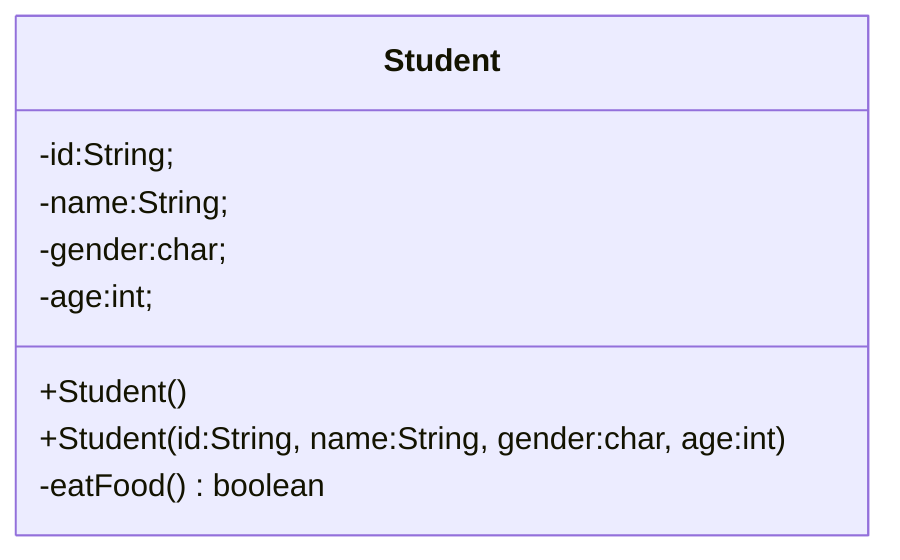
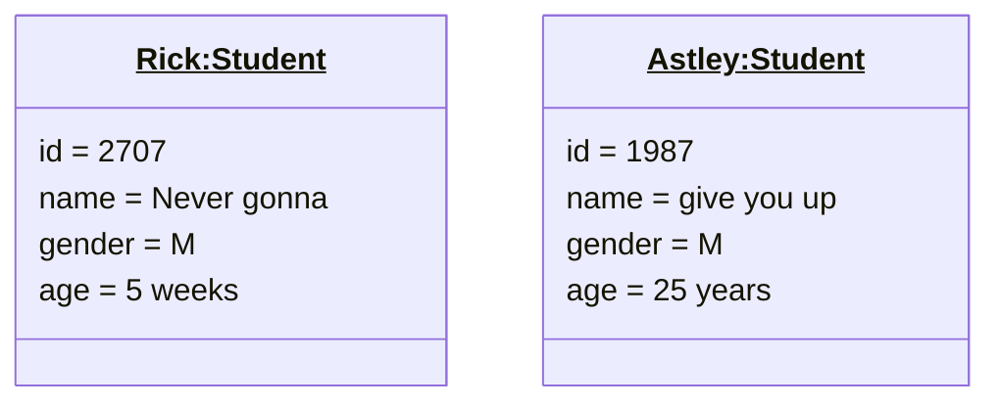
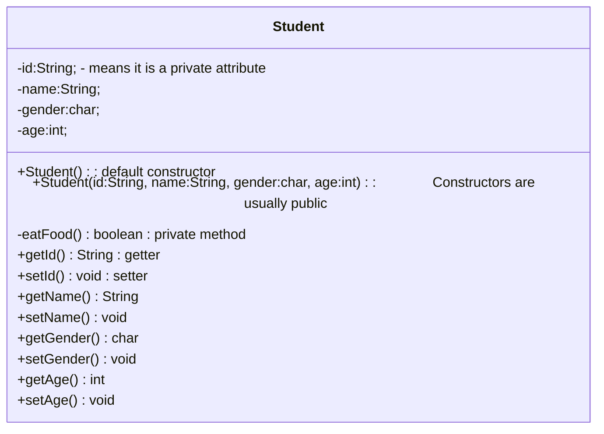

>[!Reminder] Programming Paradigm
>Java uses [[Introduction to OOP#What is Object-Oriented Programming?|OOP]]
# Java Classes
In languages that support OOP, classes usually look like this 
```pseudocode
class CLASSNAME
	attributes
	constructor
	methods
```
In Java specifically, it looks like this, 

*Snippet A: Student*
```java
public class Student{
	// Attributes
	private String id;
	private String name
	private char gender;
	private int age;
	private String course;
	
	// Constructors
	public Student(){}
	public Student(String id, String name, char gender, int age, String course){
		this.id = id;
		this.name = name;
		this.gender = gender;
		this.age = age;
		this.course = course;
	}
	
	// Methods
	public String getName(){ return name; }
}
```

^b9c2ac

Introducing or demonstrating our program via codes that we wrote to outsiders, especially those who are not technically-equipped can be difficult. 

>[!NOTE] How To: Present
>1. Simplify the Language
>		- Avoid jargon and use simple, clear language
>2. Use Analogies
>		- Relate complex ideas to every day experiences
>3. Visual Aids
>		- Use diagrams, charts, and visual representations 
>4. Interactive Demos

Keep in mind that [[Introduction to OOP#^981663|you have to plan]] before implementing any code. This begs for a method to visualise and show the flow and functions of the program in a non-esoteric manner. 
## UML Diagram
>[!DEFINITION] Unified Modelling Language
>It is a standardised modelling language for object-oriented system analysis, design and development.
>

*UML A: Student* ^26f9cd


> The "-" sign means it is private while the "+" sign means it is public. 

*UML B:* To create a diagram for instances

## Visibility Modifiers
*What does `private` and `public` mean?*
- `private` 
	- Methods or attributes that can only be accessed by within the same class in which they are declared. ^686cdd
		- They are not accessible from outside the class
- `public` 
	- Methods or attributes that be accessed by any class in any package. 
		- It just means they are globally accessible

*So, why do we need control access to certain methods and attributes?*<br>This is important to prevent any unauthorised changes or access to important attributes of a class. 

*So, if we make a method or an attribute private, how do we access those?*

We do that with *getters* and *setters*.
- *getters* are used to read private attributes
- *setters* are sued to modify private attributes

Referring back to [[Objects and Classes#^26f9cd|Student UML]], we would add the following,


*Snippet B: Visibility*
```java
public class Main{
	public static void main(String[] args){
		Student student = new Student();
		student.eatFood();
		
		Circle circle = new Circle();
		circle.eatFood(); // Error
	}
}
```
There is also another access modifier known as `default` or *package private modifier*. This means that the attributes or methods are only accessible by classes - even if they're different - in the same package.
# Constructor
Constructor is a tool that is used to quickly insert values to an object during construction of the object. 

There are rules and characteristics to keep in mind when creating a constructor:
1. The name of the constructor must be the same as the class
2. The constructor cannot return any value
3. Constructors can be overloaded
4. Default constructor is required
	- If no constructor is explicitly defined, the Java compiler will implicitly define a default constructor.
	- If a custom constructor is defined, an explicitly defined constructor is required. 
5. Constructors cannot be inherited
6. A superclass's constructor can be called with `.super()`
7. Constructors can be private
	- But there's really no point in doing this, lest there is a very specific reason
8. If the class `extends` another class, the constructor will begin with `super()`
	- `super()` is called implicitly, so a if a superclass has a custom constructor, a default construct has to be defined.

A constructor will be invoked with `new` keyword
```java
// new Student() <-- this invokes a default constructor.
Student student = new Student();
```
## Copy constructor
You can also construct an object as a copy of another with a copy constructor. Unlike C++, Java does not have built-in copy constructor, meaning, you can't do this. 

*Snippet C: No built-in copy constructor*
```java
public class Student{
	// Attributes
	private String id;
	private String name
	private char gender;
	private int age;
	private String course;
	
	// Constructors
	public Student(){}
	public Student(String id, String name, char gender, int age, String course){
		this.id = id;
		this.name = name;
		this.gender = gender;
		this.age = age;
		this.course = course;
	}
	
	// Methods
	public String getName(){ return name; }
}

public class Main{
	public static void main(String[] args){
		Student student = new Student();
		Student studentB = new Student(student)
	}
}
```
The code above fails because there is no copy constructor defined. To fix this, the following code is needed:

*Snippet D: Copy Constructor*
```java
public Student(Student student){
	id = student.id;
	name = student.name;
	gender = student.gender;
	age = student.age;
	course = student.course;
}
```
As shown with the multiple definition of constructors, constructors can be overloaded. 
# Default values
When no default values are defined for the attributes **outside of any methods**, Java assigns its own default values. 

| Datatype       | Values   |
| -------------- | -------- |
| Reference type | None     |
| Numeric type   | 0        |
| Boolean type   | false    |
| Char type      | '\u0000' |
# `this`
>[!DEFINITION]
>`this` keyword is used to refer to itself.

*Snippet E: `this`*
```java
	public Student(String id, String name, char gender, int age, String course){
		this.id = id;
		this.name = name;
		this.gender = gender;
		this.age = age;
		this.course = course;
	}
```
In this say, `this` refers to the `Student` object being initialised. 

*So, when do we use it?*<br>One of the many use cases is when the attributes have the same name as the parameters in the constructor as shown above.

*Snippet F:`Student` constructor*
```java
	public Student(String id, String name, char gender, int age, String course){
		id = id;
		name = name;
		gender = gender;
		age = age;
		course = course;
	}
```
The code above will cause an error as the compiler does not know which variable to refer to. 

Another use case is to invoke another constructor in a constructor of the same class.

*Snippet G: Calling constructor with `this`*
```java
	public Student(String id){ this.id = id; }
	public Student(){
		this(100);
	}
```

>[!NOTE] Naming Convention in C++
>In C++, a common practice in naming the variables is beginning them with prefix `m_` to differentiate them with non-member variables.
>```cpp
>class Foo{
>private:
>	int m_x{};
>public:
>	Foo(int x) : m_x (x){}
>};
>```
# Primitive vs Object Types
>[!Reminder] 
>See: [[Introduction to OOP#Variables|Variables]]

When a primitive datatype is copied, it is the values that are copied whereas when a reference type is copied, it is the address of the variable. 

*Snippet H: Copying variables*
```java
int i = 5;
int j = i

Circle circle1 = new Circle(5);
Circle circle2 = new Circle(10);

circle1 = circle2
```

`circle2` will point to the same address as `circle1` rather than creating a new object. The older address that `circle2` was pointing to will be marked for garbage collection.
# Immutability
It is also possible to make certain objects immutable.
>[!DEFINITION] Immutable
>No modification is allowed after its initialisation

For a class to be immutable, 
1. All attributes are [[Objects and Classes#^686cdd|private]]
2. There are no mutators (setters)
3. There are no accessors (getters) that can return a reference to a data field that is mutable

*What does the third point mean?*
If the return value of a method is a reference type, its memory address will be returned, and this, inadvertently, makes the data field mutable.  
```java
public class Student { 
	private int id; 
	private Pet pet; 
	
	public Person(int ssn, String name, String breed, int age){ 
		id = ssn; 
		pet = new Pet(name, breed, age); 
	} 
	public int getId() { 
		return id; // return the value of id 
	} 
	public Pet getPet() { 
		return pet; // return the reference of birthDate 
	} 
	public void showPersonInfo() { 
		System.out.println("ID is "+id); 
		pet.showPet(); 
	} 
}	
```
In the code above, `getPet()` returns a reference of `pet`. This makes `pet` mutable and thus, `Student` becomes mutable. 
```java
Pet stealPet = student.getPet();
stealPet.setName("Poo")
```
*So, how do we stop this?*<br>We make `getPet()` return a copy instead. 
```java
	public Pet getPet() { 
		return new Pet(pet); // uses copy constructor 
	} 
```
>[!NOTE] String
>Strings aren't mutable too. 

# Noteworthy packages
These are some common noteworthy packages to explore: 
1. [Math](https://docs.oracle.com/javase/8/docs/api/java/lang/Math.html)
2. [Random](https://docs.oracle.com/javase/8/docs/api/java/util/Random.html)
3. [String](https://docs.oracle.com/javase/8/docs/api/java/lang/String.html)
4. [StringBuilder](https://docs.oracle.com/javase/8/docs/api/java/lang/StringBuilder.html)
5. [Character](https://docs.oracle.com/javase/8/docs/api/java/lang/Character.html)